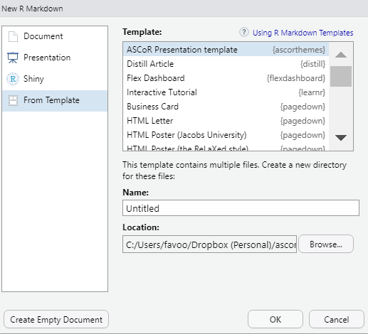

<!-- README.md is generated from README.Rmd. Please edit that file -->

# ascorthemes

<!-- badges: start -->

<!-- badges: end -->

The goal of ascorthemes is to provide access to an ASCoR template for
[xaringan](https://slides.yihui.org/xaringan/#1) slides.

## Installation

You can install `ascorthemes` from GitHub with:

``` r
devtools::install_github("favstats/ascorthemes")
```

## Basic use

xaringan presentation with ASCoR branding can be access easily using the
RStudio IDE, by selecting `File` -\> `R markdown ...` -\> `From
Template`.



## Preview

Check out a live version of the template
[here](https://favstats.github.io/ascorthemes/).

<div class="figure">


<p class="caption">

Title Slide

</p>

</div>

<div class="figure">


<p class="caption">

Normal Slide

</p>

</div>

<div class="figure">


<p class="caption">

Black Slide

</p>

</div>

<div class="figure">


<p class="caption">

White Slide

</p>

</div>
